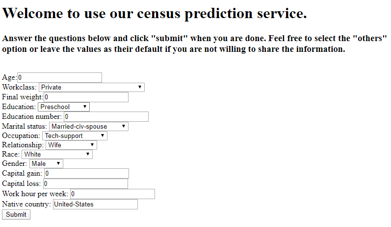
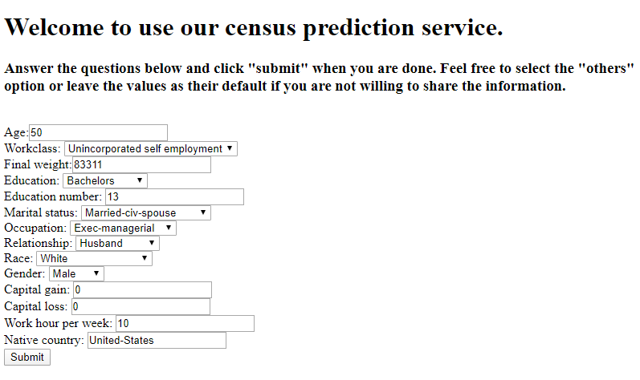
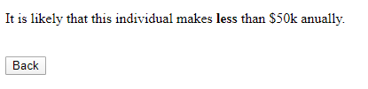
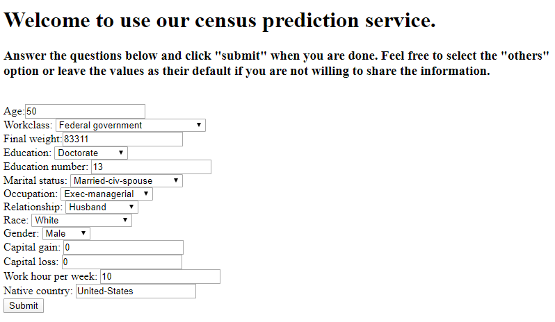
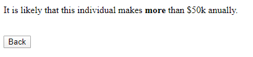

# Team Project
## A census predictor for individuals

This is the Final team project for Data Analysis at Scale in the Cloud (ECE 590).

In this project, we build a machine learning model to predict whether an individual gets an anual income of more than $50k, given some information about this person. We train the model based on the [adult dataset](https://archive.ics.uci.edu/ml/datasets/adult) and deploy the service on [google cloud](https://cloud.google.com/). Note that we will not store any private information and this project is just for fun.

## Usage
Our model can be accessed by anyone with this [link](https://team-project-276014.ue.r.appspot.com/). It will look like this:

Now we can input someone's information to the web service. For example, we have the following guy:

After we finish the information, we can click the submit button. The prediction result will be returned shortly:

It seeems likely for this person to have an income of less than $50k anually, based on our model.

Now, if we change the work class and the education information of this man as follows:

We let the model make the prediction again.

Our model makes a different prediction! Looks like our model cherish the government employment and a higher education level.

A video demo of this project can be found here TBA.
